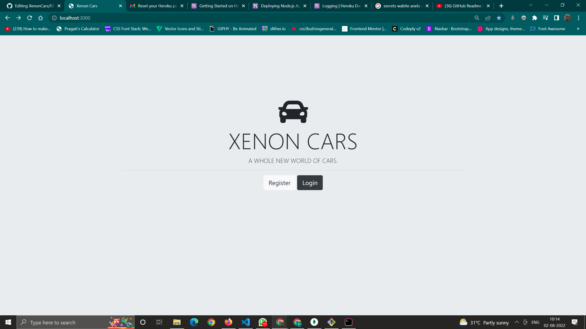
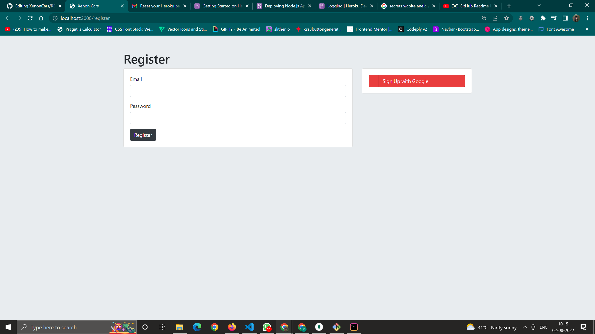
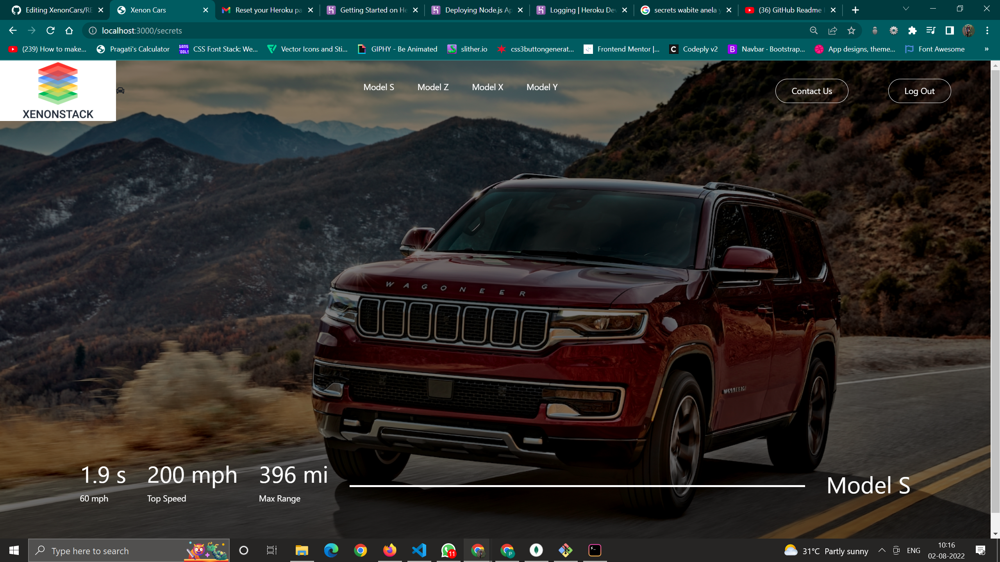
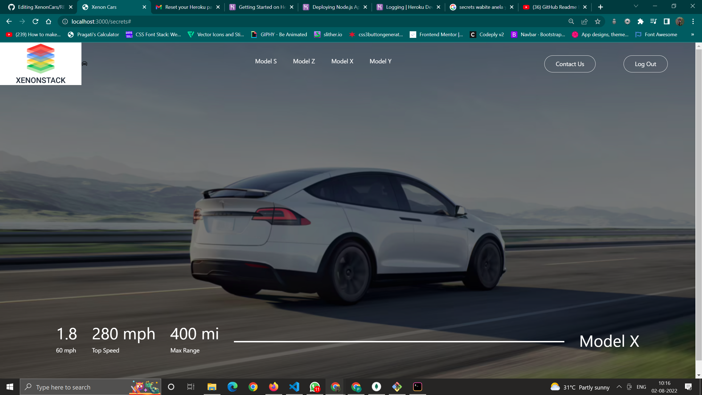
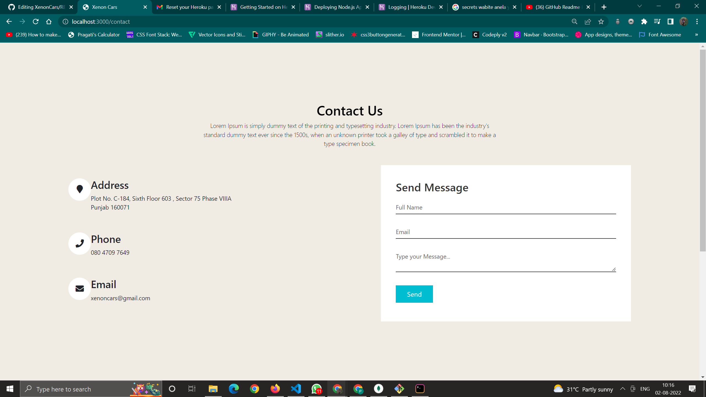
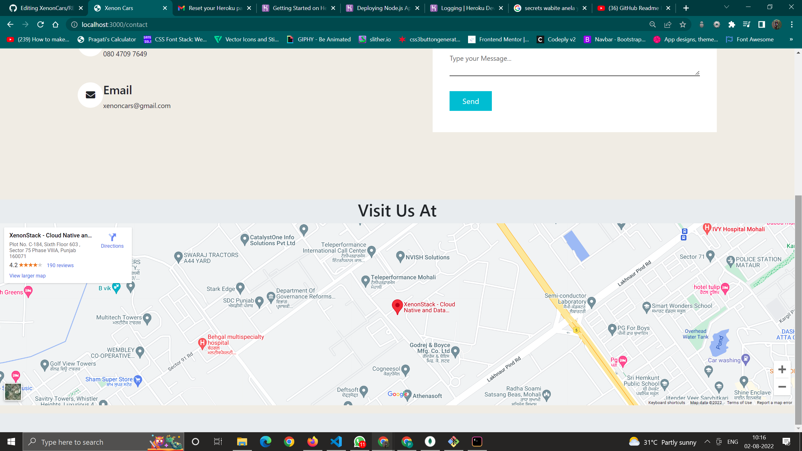
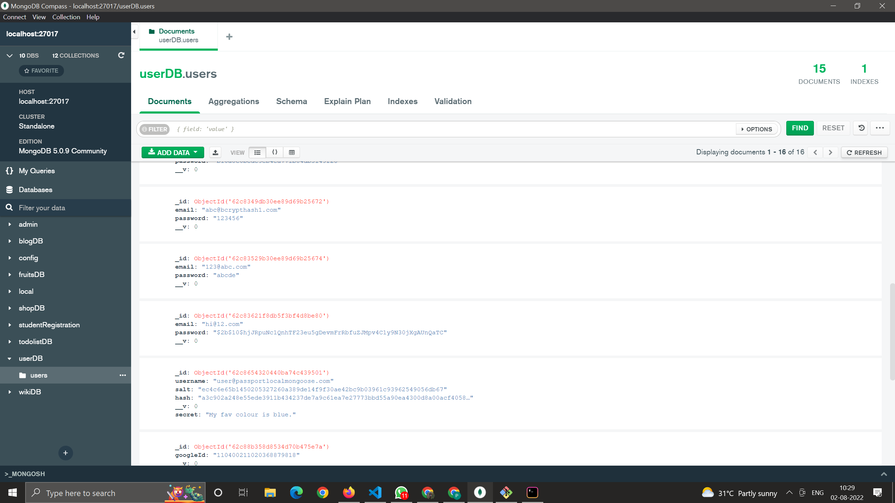

# XenonCars
Secrets
 An app where a user can sign up and register to get to the Xenon-cars page.

Technologies
Used HTML5, CSS3, Bootstrap and JavaScript to develop the front-end
Node.js and Express.js to create server and develop back-end
Used MongoDB (Mongoose) as the database
EJS as the template engine
Used Passport.js to implement third party OAuth2 to authorize the users using Google and Facebook
Prerequisite
Download, install and setup Node.js
Download, install and setup MongoDB and Robo3T
Install Nodemon (optional)

Setup
User needs to Clone the repo using git clone to their local repo
Now, open gitbash or any other terminal and navigate to the project folder
Next step is to install the node modules using the command npm install
When the modules are installed, type node app.js. User can also type nodemon app.js if they have nodemon installed
Running the command will set up our server and the user can see the message - "Server has started running successfully"

Getting Started
Now, user needs to open the browser and go to localhost:3000 to open the website
User can now follow the prompts on the website to register and login on the app. User can also login using there Google or Facebook id
When user is logged in, the user can see hme page. They can also click on contact us button which will redirect them to the next page
On the next page, user can type their queries and and click on submit button to post their quesries.
A user can also logout from the app whenever he wants too.

Working
The website contains 5 web pages . The first webpage containes login/register button to get to the register if the user is new to the website otherwise login and continue to the home page of the website . In register and login page i have also attach login with google functionality which directly login and take the user to the xenon-cars home page . The home page contains a logo and navbar which on click show the user different cars with their features . It also contains a Contact Us page in which a contact form is designed and the address, phone no and email are provided. I also embedded a google map for the directions of the Company. The home page also contains a logout button at the top-right corner which will directly redirect the user to the login page .

The website is working absolutely fine in the localhost but somehow it is giving error in the deployment and at this moment i didnot have that much time to solve the errors so i cannot be able to host the website but i attached the pictures of all the webpages. 

Screenshots

